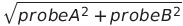

#SNP6_ASM

Scripts for calling Allele specific methylation from Affymetrix SNP6.0 arrays.

##Requirements
Affymetrix SNP6.0 library (cdf) file - download from [Netaffx](http://www.affymetrix.com/analysis/index.affx) or from [here](http://dl.dropboxusercontent.com/u/4253254/resources/SNP6/GenomeWideSNP_6.Full.cdf)

##Usage

###1. Extract all probes raw intensities 

Extracts all the raw probe intensities for probes on the array. Each array has multiple identical probes against the same sequence, physically distributed across array (to adjust for potential area specific artefacts). This script extracts all those intensities.
   
       optional arguments:
      -h, --help            show this help message and exit
 
    required arguments:
      -c CELDIR, --CELdir CELDIR
                        directory containing CEL files
      -a APTDIR, --aptdir APTDIR
                        directory containing apt-cel-extract binary
      -d CDFFILE, --CDFfile CDFFILE
                        full path to CDF file for AffySNP6 chip

**Notes:**  
Make sure all your CEL file extensions are in UPPERCASE

**Output**: tab delimited file for every sample in the CEL file directory, with ".CEL" file extension replaced with "rawints.txt" file extension. Located in the original CEL file directory.

###2. Median summarize probe intensities

This script takes the median (no the mean, as the mean is sensitive to outliers) of the intensities of the identical probes you extracted in step 1. 

    Rscript median_summarize_intensities.R CELDIR

**Notes:**   
Use same CEL file directory as in step 1.

R library dependencies:
- reshape 
- plyr
- getopt

**Output**: tab delimited file containing data for ALL sample in the CEL file directory. Column headings are taken from the full filenames. Rownames are from probeIDs (separate probeIDs for each allele). Located in the original CEL file directory.

###3. Normalize Arrays

In basic terms, separate the probesets into those with a MSRE site (MPRs) and those without (MNRs). Quantile normalize the MNRs (using a HapMap sample as a model distribution) and then use those to interpolate the intensity values of the MPRs (based on which MNR they were closest to before quantile normalizing the MNRs).

    perl quantilerobust_MSREinsensitive_normalize.pl \
    --datafile /path/to/median/summarized/data/median.summarized.intensities.tab \
    --mnrfile /path/to/MNR/probeids/MNR_probeids.txt \
    --mprfile /path/to/MPR/probeids/MPR_probeids.txt \
    --modelfile /path/to/HapMap/model/file/HapMapMODEL-NA06985_C_F3_quant.txt

**Notes:**
Script output to the directory from which it was run. It will output a normalized data file (tab-delimited) for each sample with the file extension of _quant.txt
It will also output 6 other files which can be used to troubleshoot any problems with the script. They can be erased if the normalization worked as expected.

    tempfile.txt - temporary file (delete)
    rawUNCUT.txt - MNR probe intensities before normalization
    rawCUT.txt - MPR probe intensities before normalization
    quantUNCUT.txt - quantile normalized MNR probe intensities
    quant-rawUNCUTadjustments.txt - - adjustements performed on MNRs during quantile normalization (to be applied to MPR neighbors)
    MODEL_quant.txt - quantile normalized model probe intensities

###4. Calculate allelic ratios and total intensities
 
Next step is to calculate:
a) the total probe intensity for both alleles   
b)  the log2(A/B) probe intensity ratios for all heterozygote genotypes for each sample

  

##Note

This is a work in progress. 

The initial R methods using aroma.affymetrix are too slow. Replaced them with the affy power tools to extract initial intensities and then median summarize in R.

In the interest of time, rather than make an integrated program, I've split up the steps into individual scripts.
 
Next steps are to properly integrate the quantile normalization steps.

Currently very slow, with the main slowdown happening at the reformat of the data structure after extracting the raw intensities. 
